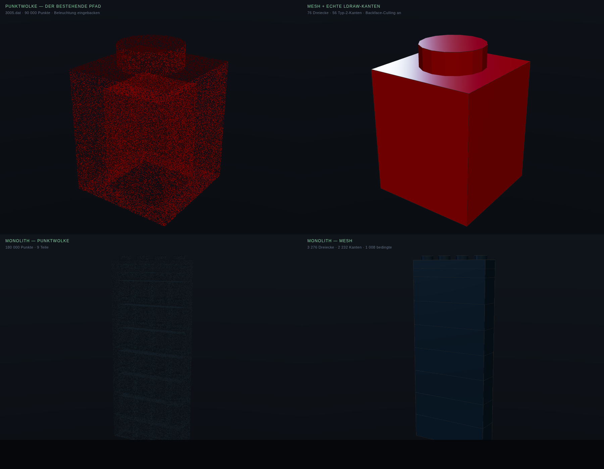

# Mesh-vs-points spike — S0, answering D8

**The question:** *does the mesh renderer actually beat the point renderer?*
Everything in Phase 1 assumes yes. This is the afternoon that checks, before
nine milestones are built on the assumption.

**And a second job it did anyway:** pre-flighting the hardest claim in M51 —
that BFC winding composes correctly down a real LDraw reference chain, and
that type-2 / type-5 edges can be pulled out of real part files. It found a
defect there that would have been much more expensive to find in M54.

```sh
python3 resolve_ldraw.py ../../ldraw-scenes/monolith.ldr -o out/
# then: npm i three@0.185, serve this directory, open render.html
```

Throwaway. The real thing is M51–M54 in Rust.



## Verdict on D8: mesh, decisively — for anything the camera gets close to

The top row is a real 1×1 brick, `3005.dat`, LDraw red, same camera both
sides. The point cloud at 90 000 points has **no silhouette**: the edge of the
object is a probability, the stud is a smear, and the top face and the front
face are the same haze. The mesh is a brick. There is nothing to weigh up.

The bottom row is the monolith, and it is the more interesting comparison —
at that distance the point cloud is *almost* adequate, which is exactly why
[`phase1-renderer.md`](../../docs/fugen/phase1-renderer.md)'s decision to keep
the point pipeline for crowd distance and screen-space outlines is right. The
mesh still wins, but not by the margin the close shot shows.

**So Phase 1 proceeds as specified**, and the point pipeline stays exactly
where the spec already puts it: Act I's opening swarm, Act IV's dissolve, and
anything far enough away that its outline would merge into a black mass.

## What it found, and what has to change because of it

**1. The LDU→mm conversion is a mirror, and it inverts backface culling for
the entire library.** LDraw is Y-down; spex is Y-up. Negating Y flips
handedness, so every triangle's winding ends up backwards relative to its own
outward normal — and a renderer that culls by winding, which is all of them,
draws the inside of the far wall instead of the outside of the near one. The
first two renders showed a *transparent* brick: outer walls gone, inner tube
visible through them.

The fix is one line — swap two vertices of every triangle at the conversion —
but nothing about the symptom points at the cause. **M52 must do this at the
bundle boundary and say why**, or M54's "no interior faces" criterion fails
for a reason nobody will find quickly.

**2. M51's outward-normal acceptance criterion is not measurable as written.**
It asks for ≥ 95 % of faces pointing outward, tested against the part's
centroid. Measured here: **89.5 % for the 1×1 brick, 65 % for the monolith.**
Both numbers are meaningless. A brick is a hollow box with an internal tube,
so its inner walls legitimately face inward; a nine-part stack has a centroid
that is inside six of its parts. The criterion should be restated as what
actually settles it: **render with backface culling on and see no interior.**
That is a picture, not a percentage, and it is the check that caught defect 1.

**3. BFC composition itself works.** Resolving the monolith touched **369
real files**, hit **9 `INVERTNEXT` directives** and **49 mirrored references**
(negative-determinant matrices), and found **zero uncertified files**. All
three mechanisms compose as the spec describes. The recursion is real and it
holds.

**4. The colour-space defect from review 01 (B12) is confirmed live.** Feeding
LDraw's sRGB values straight into three.js as vertex colours renders every
material far too bright, because r152+ treats them as linear. Converting
properly darkens LDraw Black to what it actually is — and then the black
monolith on a near-black field almost disappears, which is precisely what the
technical-art review warned about for A1-S06. **Both fixes are needed
together:** correct colour *and* a real lighting rig, or Act I's closing shot
is a grey wireframe.

**5. M57's fat lines are not a nicety.** The type-2 edges are drawn in the
right panel and at this scale they are barely visible — 1-pixel
`LineBasicMaterial` lines, which is exactly what the milestone says not to
ship. The catalogue look depends on that milestone being done properly.

## Real numbers, for M52's budget

| | 1×1 brick (`3005`) | Monolith (9 parts) |
|---|---|---|
| Files resolved | 21 | 369 |
| Triangles | 76 | 3 276 |
| Hard edges (type 2) | 56 | 2 232 |
| Conditional edges (type 5) | 16 | 1 008 |
| `INVERTNEXT` | 1 | 9 |
| Mirrored references | 1 | 49 |
| Uncertified files | none | none |

**Note the ratio: 2 232 hard edges against 3 276 triangles.** Edges are not a
rounding error on top of the mesh — they are comparable in count, and at Atlas
scale they are the dominant cost. That is the number behind
[`budgets.md`](../../docs/fugen/budgets.md)'s rule that geometric edges are for
hero shots and everything else gets a screen-space outline.

## What this spike does not answer

Nothing about performance, instancing, LOD, materials beyond one plastic, or
conditional edges actually being *drawn* — they are extracted and counted
here, not rendered. And it is Python, single-threaded, with a JSON
intermediate: the resolve took minutes where `spex-ldraw` takes moments. None
of that is evidence about the real pipeline; it is evidence about the picture.
